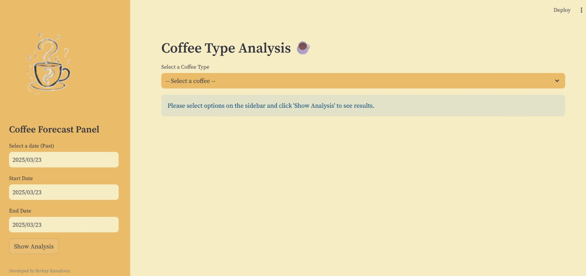
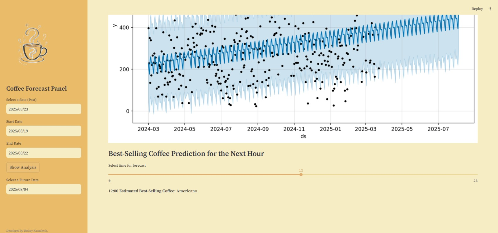

# Coffee Forecast App

An interactive Streamlit application for analyzing coffee sales and forecasting future income using historical data. The app supports both retrospective analysis and future predictions using the Prophet model and machine learning.

## Features

-  Analyze income, most sold coffee, and payment method on a specific past day  
-  Summarize total income and trends over a selected date range  
-  Detailed analysis for a selected coffee type  
-  Forecast future income using the Prophet time series model  
-  Predict the best-selling coffee using a Random Forest Classifier  

##  Interface Preview

<p align="center">
  
  
</p>

##  Requirements

To install all required dependencies:

```bash
pip install -r requirements.txt


## How to Run

python -m streamlit run Coffee_Analysis.py

